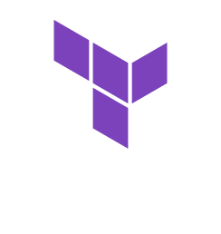
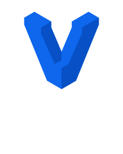
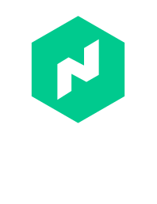

  
  

    
    
  

  
  <h1>
    hey there
    
  </h1>

### :man_technologist: About Me :

I am a Full time DevOps from India.

- :muscle: Dailying Manjaro Arch linux.

- :telescope: Exploting Golang.

- :seedling: Making Optimized CICDs.

- :zap: In my free time, I try to solve general problems & contribute to OSS.

### :hammer_and_wrench: I'm aware of :

Infra

CICDs/IaC

Languages

Tools

DB/Operators/Monitoring

SCM

Other

<!--  -->

Hashi-stack

---

**May the source be with you**
